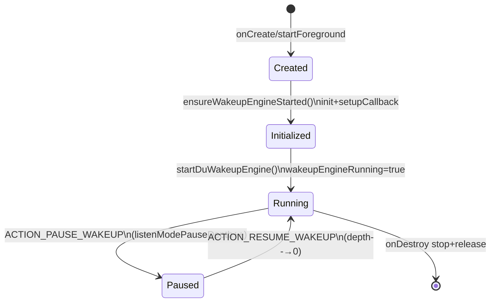
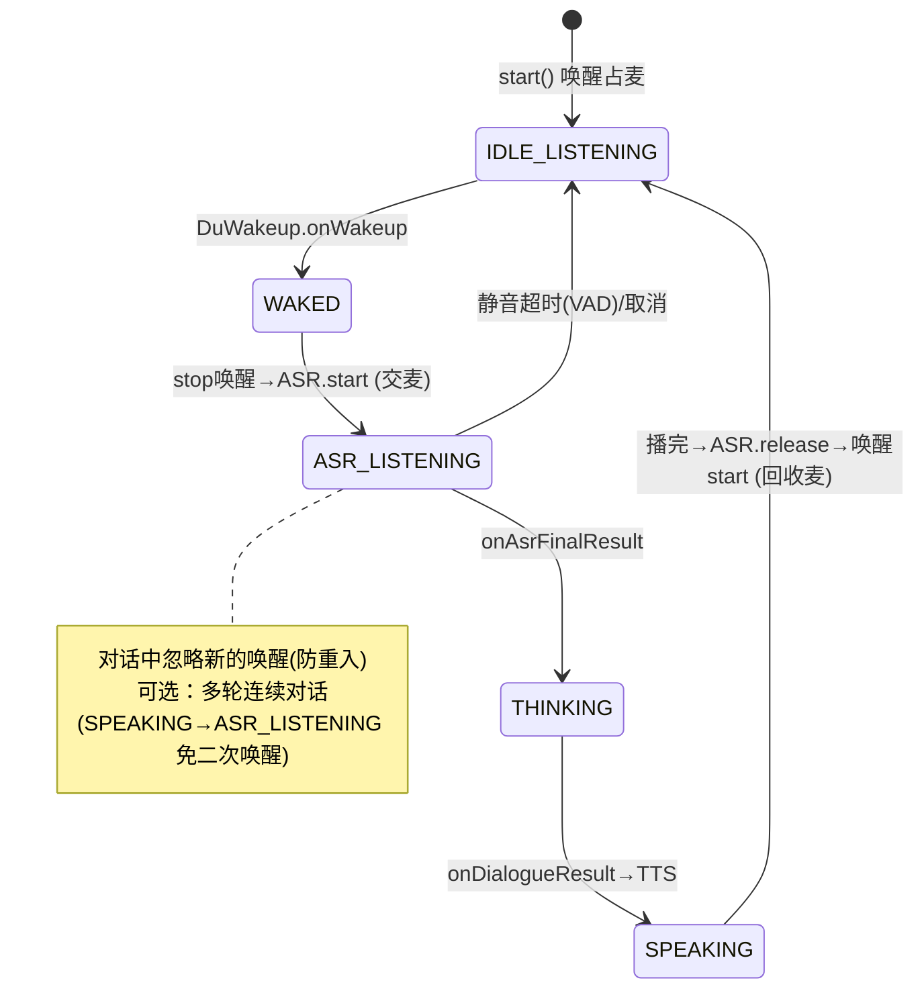

# AI-SDK 语音唤醒能力集成方案（结合语音助手）

> 目标：AI-SDK 对外提供「语音唤醒」能力，复用 `Reference/lingxi-agent` 中已在使用的百度 DuerOS `DuWakeup` 引擎，并把唤醒与已有的语音助手（ASR 智能对话）串成「喊一声→直接对话」的闭环。

---

## 一、模块全景与文件清单（lingxi-agent 现状）

语音唤醒功能横跨「后台常驻服务 + 权限管理 + UI 交互 + ASR 对话接管」四层，核心文件如下：

| 层级 | 文件 | 职责 |
|---|---|---|
| **唤醒引擎服务** | `service/WakeUpService.java` | 前台常驻服务，封装 DuWakeup 引擎、唤醒回调、拦截逻辑 |
| **权限/开关管理** | `util/WakeUpPermissionHelper.java` | 权限检查、服务启停、三种唤醒开关的 SP 持久化 |
| **唤醒后 UI** | `WakeVoiceActivity.kt` / `WakeVoiceActivity1.kt` | 唤醒成功后的语音交互页 |
| **触发/透明壳** | `WakeUpTriggerActivity.kt` | 透明启动壳（BaseSplashActivity 派生）|
| **悬浮窗对话** | `lingxi/float_manager/WakeVoice.java` / `WakeVoice2.java` | 唤醒后悬浮语音对话视图，接管 ASR |
| **对话引擎** | `lingxi/lingxi_conversation/AsrManager.java` | 阿里云持续 ASR 封装（`isRecognizing()` 互斥判定）|
| **设置入口** | `view/user/UserAppSettingsActivity.java`、`GuideVoiceSettingFragment.kt` | 三个唤醒开关的 UI |
| **主界面接管** | `MainActivity.java` | 广播接收、`tryRestoreWakeUp()` 恢复逻辑 |

---

## 二、核心唤醒引擎：百度 DuerOS DuWakeup

关键发现：**实际生产使用的是百度 DuerOS 的 `ai.dueros.wakeup.DuWakeup`**，而非 sherpa-onnx。

- `app/proguard-rules.pro` 中保留了 `com.k2fsa.sherpa.onnx.KeywordSpotter` 等类，但代码中**未见任何 sherpa 调用** → 疑似**遗留/废弃依赖**，建议确认后清理。

### 引擎初始化配置（`initDuWakeup`）

```java
cfg.wakeConfig.wakeThreshold = 0.90f;       // 唤醒置信度阈值（偏高，抗误唤醒）
cfg.wakeConfig.wakeInterval = 1900;         // 唤醒间隔 1.9s（防连续触发）
cfg.wakeConfig.detectionWindowsFrames = 40; // 检测窗口帧数
cfg.wakeConfig.thresholdFramesCount = 1;    // 达阈值帧数
cfg.isCustomWords = true;                    // 自定义唤醒词
cfg.wakeConfig.saveWakeupAudio = Beta ? true : false; // Beta 存唤醒音频便于调试
```

唤醒词：`new String[]{"灵犀灵犀"}`（`startDuWakeupEngine`）。

---

## 三、生命周期与状态机（WakeUpService）

`WakeUpService` 是 `microphone` 类型前台服务（Manifest 已声明 `foregroundServiceType="microphone"`），核心状态机由三个标志位驱动：



- `wakeupInitialized` / `wakeupEngineRunning` / `listenModePauseDepth` 三标志控制。
- **聆听模式麦克风互斥**：录音时通过 `ACTION_PAUSE_WAKEUP` 停引擎释放 mic，用**引用计数 `listenModePauseDepth`** 支持嵌套 pause/resume，设计严谨。

---

## 四、唤醒回调的多重拦截门（`onWakeup`）

唤醒成功后依次经过 **6 道拦截门**才真正触发，抗误唤醒设计良好：

1. `System.currentTimeMillis() - startServiceTime < 1500` → 服务刚启动 1.5s 内忽略（防启动自激）
2. `isKillScreen()` → 息屏忽略
3. `isLocked()` → 锁屏忽略
4. `AsrManager.isRecognizing()` → 正在 ASR 识别忽略（**避免与对话打架**）
5. 当前是 `WakeVoiceActivity` → 先 finish 旧页
6. `AgentStatus.INSTANCE.isRunning()` → GUI Agent 运行中忽略

通过后：前台播 `"嗯"`、后台播 `"我在"`（实际播放 `R.raw.wakeup` 音效），TTS 结束回调里 `showFloatView()` 弹悬浮对话窗。

---

## 五、三种唤醒方式

`WakeUpPermissionHelper` 用 `MODE_MULTI_PROCESS` SP 持久化三个独立开关（跨进程读写）：

| 开关 | SP Key | 权限要求 |
|---|---|---|
| 语音唤醒 | `wakeup_enabled` | 录音 + 通知(13+) + 悬浮窗 |
| 电源键唤醒 | `wakeup_power_enabled` | 无需通知权限 |
| 键盘唤醒 | `wakeup_keyboard_enabled` | 无需通知权限 |

状态变更通过 `sendSwitchBroadcast()`（`SWITCH_STATE_CHANGED`）通知其他进程。

---

## 六、现状风险点与优化建议（lingxi-agent）

**需关注**

1. **`initWakeUp()` 死代码**：与 `initDuWakeup()` 重复且从未被调用，缺 `isCustomWords`。建议删除。
2. **sherpa-onnx 混淆规则疑似废弃**：确认无引用后清理 proguard 规则与依赖。
3. **`MODE_MULTI_PROCESS` 已被 Android 官方废弃**（不保证跨进程一致性），高并发下可能读到脏值。若确需跨进程，建议迁移 `ContentProvider` 或 `MMKV`。
4. **广播 `RECEIVER_EXPORTED`**（MainActivity）：`ACTION_WAKEUP_SUCCESS` / `ACTION_PLAY_TTS` 导出为 EXPORTED，存在**被第三方 App 伪造广播触发 TTS/唤醒**的风险，建议改 `RECEIVER_NOT_EXPORTED` 或加签名级权限。

**可优化**

5. `isAppInForeground()` 用 `getRunningAppProcesses()` 判前台在高版本 Android 可能不准，建议用 `ProcessLifecycleOwner` / `ActivityLifecycleCallbacks`。
6. `onWakeup` 中大量注释掉的判断逻辑，建议清理以免维护误读。
7. `WakeVoiceActivity` 与 `WakeVoiceActivity1`、`WakeVoice` 与 `WakeVoice2` 双份并存，建议确认收敛。

---

## 七、把 DuWakeup 唤醒能力「搬进」AI-SDK

### 7.1 唤醒能力的「真身」在哪里

lingxi-agent 的唤醒能力 = **一个 AAR + 一段封装代码**：

| 组成 | 位置 | 说明 |
|---|---|---|
| **引擎 AAR** | `Reference/lingxi-agent/app/libs/wakeup-v1.0.15.260312.174629-release.aar` | 百度 DuerOS 唤醒引擎，包名 `ai.dueros.wakeup.*`。**.so native 库和唤醒模型都打包在 AAR 内部**（`jniLibs/` 里只有 `libCtaApiLib.so`/`libamapkey.so`，与唤醒无关 → 证明唤醒自带 so/model） |
| **封装逻辑** | `service/WakeUpService.java` | 用 `DuWakeup.getInstance()` + `WakeupInitConfig` + `WakeupCallback` + `DuWakeupIntent` 实现 init/start/stop/pause/resume |
| **依赖 API** | `ai.dueros.wakeup.{DuWakeup, WakeupInitConfig, DuWakeupIntent, WakeupCallback, WakeupEventInfo, DuWakeupError}` | 全部来自该 AAR |

### 7.2 SDK 的打包架构（决定 AAR 怎么塞进去）

- **`ai-sdk` 是 fat-aar 宿主**（`com.kezong.fat-aar` 插件），通过 `embed` 聚合 4 个子模块：

  ```gradle
  embed project(':deviceAccess_gatewayProxy')
  embed project(':aiFoundationKit')
  embed project(':asrTranslation')
  embed project(':asrIntelligentDialogue')
  ```

  产出 `AI-SDK-x.x.x.aar`（正是 lingxi-agent `app/libs/AI-SDK-1.1.4-debug.aar` 的来源）。
- 子模块 `minifyEnabled false`，**统一由 ai-sdk 宿主做单次 R8 混淆**。
- 子模块 `implementation fileTree(include: ['*.jar'], dir: 'libs')` —— 注意**只含 `*.jar`，不含 `*.aar`**。

#### ⚠️ 核心难点：AAR 里嵌套 AAR

fat-aar 的 `embed project(...)` 聚合的是**子模块自身产物**，子模块用 `implementation(name:'wakeup', ext:'aar')` 引入的第三方 AAR **默认不会被打进最终 fat-aar**。

正确做法：**在 ai-sdk 宿主层用 `embed` 直接嵌入 wakeup AAR**：

```gradle
// ai-sdk/build.gradle
repositories { flatDir { dirs 'libs' } }
dependencies {
    embed(name: 'wakeup-v1.0.15.260312.174629-release', ext: 'aar')  // .so/model 一并聚合
    // ...
}
```

再把 AAR 文件复制到 `ai-sdk/libs/`。这样 native `.so`、`assets` 模型、`classes.jar` 都会被 fat-aar 合并进最终 SDK AAR。

### 7.3 封装成 SDK API（去 Service 化）

新增 `com.cmdc.ai.assist.api.VoiceWakeup`（建议放 `deviceAccess_gatewayProxy` 模块，与 `IRecordStream`/其它 api 同包），把 `WakeUpService` 的**引擎逻辑**提炼出来，剥离 App 产品逻辑（通知/悬浮窗/TTS「我在」/锁屏息屏判断）：

```kotlin
class VoiceWakeup internal constructor() {
    interface WakeupListener {
        fun onInit() {}
        fun onStart() {}
        fun onWakeup(word: String)        // 对应 WakeupEventInfo.word
        fun onError(code: Int, msg: String) {}
    }
    data class Config(
        val keywords: List<String> = listOf("灵犀灵犀"),
        val wakeThreshold: Float = 0.90f,     // 直接沿用 lingxi 参数
        val wakeInterval: Int = 1900,
        val detectionWindowsFrames: Int = 40,
        val thresholdFramesCount: Int = 1,
        val isCustomWords: Boolean = true,
        val saveWakeupAudio: Boolean = false,
    )
    fun init(context: Context, config: Config)   // → DuWakeup.init + setWakeupCallback
    fun start()                                   // → DuWakeup.start(DuWakeupIntent)
    fun stop()                                    // 让麦克风给 ASR
    fun release()                                 // → DuWakeup.release
}
```

门面暴露：`AIFoundationKit.voiceWakeupHelp(): VoiceWakeup`（与 `speechRecognitionPersistentHelp()` 同风格）。

> 拦截门（1.5s 冷启动忽略、AsrManager 识别中忽略等）**不搬进 SDK** —— 那是宿主策略。SDK 只忠实回调 `onWakeup`，宿主自己决定要不要拦。

### 7.4 必须同步处理的 4 个配套项

1. **ProGuard（关键，否则 JNI 回调崩溃）**：ai-sdk `proguard-rules.pro` 当前**无** dueros keep 规则，必须加：

   ```pro
   -keep class ai.dueros.wakeup.** { *; }
   ```

   （DuWakeup 通过 JNI 反向回调 Java 层，混淆改名会导致 `AbstractMethodError`/找不到回调。）

2. **ABI 一致性**：ai-sdk/子模块 `abiFilters "armeabi-v7a","arm64-v8a"`。需确认 wakeup AAR 提供的 .so ABI 覆盖这两个。

3. **麦克风争抢**：DuWakeup **自持一路 `AudioRecord`**，与 SDK 的 `MicroRecordStream` 单例是两路。唤醒→进入 ASR 前，须 `voiceWakeup.stop()` 释放 mic，ASR 结束后再 `start()`。

4. **权限/前台服务**：SDK 不含 Service。需在 SDK 文档/`Module.md` 提示宿主：声明 `RECORD_AUDIO`、`foregroundServiceType="microphone"` 前台服务保活。

---

## 八、唤醒能力「结合语音助手」= 唤醒→自动对话 的闭环编排

唤醒不是终点，是**入口开关**。「结合语音助手」= 唤醒词一响，SDK **自动接管**、直接进入「听→识别→大模型对话→播报」，用完再自己回到监听。即把 lingxi 里 `WakeUpService(DuWakeup) → WakeVoice2 → ASRIntelligentDialogue` 这条链**内聚进 SDK**。

### 8.1 「语音助手」在 SDK 里是谁

SDK 里的「语音助手主体」已经存在，就是 **`ASRIntelligentDialogue`**（`asrIntelligentDialogue` 模块）：

- `setListener()` → `startRecognition(context)`
- 回调链：`onAsrMidResult`（中间字）→ `onAsrFinalResult`（最终话）→ **`onDialogueResult`（大模型对话结果）** → `onComplete`

lingxi 的 `WakeVoice2` 正是这么用的：唤醒后 `new ASRIntelligentDialogue()` → `startRecognition()` → 拿到 `onAsrFinalResult` 就 `callback.onSuccessMsg(text)` 交给上层回答。

**整合的本质 = 把「唤醒引擎」和「已有的 ASR 对话引擎」用一个编排器串起来。**

### 8.2 重点：整合难点是「麦克风交接」，不是功能拼接

| 组件 | 麦克风来源 |
|---|---|
| 唤醒 `DuWakeup` | **自持一路 AudioRecord**（AAR 内部） |
| 语音助手 `ASRIntelligentDialogue` | 走 `MicroRecordStream` 单例 **另一路 AudioRecord** |

两路 AudioRecord 抢同一个物理麦克风 → 必须**串行交接**：

```
唤醒监听中(DuWakeup 占麦)
   └─唤醒词命中→ stop() 唤醒(放麦) ─→ ASRIntelligentDialogue.start()(拿麦)
        └─对话结束/超时 ─→ ASR.release()(放麦) ─→ 唤醒 start()(重新占麦，回到监听)
```

配套要处理的 3 个坑：

1. **交接间隙**：`stop 唤醒` 与 `ASR start` 之间有毫秒级空窗，用户紧接着说话可能丢头字 → 需给 ASR 一点前置缓冲或提示音遮盖（lingxi 用 `R.raw.wakeup` 音效+「我在」正好盖住这段）。
2. **自唤醒/回声**：唤醒词「灵犀灵犀」和 TTS 播报声可能被 ASR 收进去 → 播报时要么停 ASR，要么开 AEC。
3. **防重入**：对话中再次触发唤醒要忽略（lingxi 的 `AsrManager.isRecognizing()` 拦截门就是干这个）。

### 8.3 SDK 应提供「编排器」而非两个零件

不要让宿主自己去拼 `VoiceWakeup + ASRIntelligentDialogue + 麦克风交接`。SDK 直接提供一个**编排类**，内部组合两者、管好状态机和麦克风：

```kotlin
// com.cmdc.ai.assist.api.VoiceAssistant  （唤醒即对话）
class VoiceAssistant internal constructor(
    private val wakeup: VoiceWakeup,
    private val dialogue: ASRIntelligentDialogue,
) {
    interface Listener {
        fun onWakeup(word: String) {}              // 唤醒命中
        fun onAsrResult(asrResult: AsrResult) {}
        fun onDialogueResult(result: DialogueResult) {}   // 助手回答
        fun onStateChanged(state: State) {}
        fun onError(code: Int, msg: String) {}
    }
    enum class State { IDLE_LISTENING, WAKED, ASR_LISTENING, THINKING, SPEAKING }

    fun start()   // 进入 IDLE_LISTENING：开唤醒监听
    fun stop()    // 全停
    fun triggerManually()   // 免唤醒，直接进 ASR（对应"点按钮说话"）
}
```

门面：`AIFoundationKit.voiceAssistantHelp()`。宿主只管 `start()` 一次 + 收回调，**麦克风交接全部由 SDK 内部完成**。

### 8.4 内部状态机（「结合」的核心逻辑）



**两个产品化开关**（建议做成 Config，对齐 lingxi 行为）：

- **单轮 vs 多轮**：答完是回到「唤醒监听」还是「继续收音免唤醒」（lingxi `AsrManager.setVadTime` 控制静音判停）。
- **是否内置 TTS 播报**：SDK 是否负责把 `onDialogueResult` 转语音播报（lingxi 用 `TTSManager`）。

### 8.5 职责分层总表

| 层次 | 内容 | 归属 |
|---|---|---|
| ① 引擎 | `wakeup.aar`(DuWakeup) 用 `embed` 打进 fat-aar + keep 规则 | **SDK** |
| ② 薄封装 | `VoiceWakeup`：init/start/stop/release | **SDK** |
| ③ **整合编排** | `VoiceAssistant`：唤醒↔ASR对话 状态机 + 麦克风交接 | **SDK** |
| ④ UI/通知/前台服务/悬浮窗 | 保活、界面、权限引导 | **宿主 App** |

---

## 九、落地改动清单（预览）

1. 复制 `wakeup-v1.0.15.260312.174629-release.aar` → `ai-sdk/libs/`（及/或子模块 libs 供编译期引用）。
2. `ai-sdk/build.gradle`：`flatDir` + `embed(name:'wakeup...', ext:'aar')`。
3. 新建 `deviceAccess_gatewayProxy/.../api/VoiceWakeup.kt`（封装 DuWakeup），子模块以 `compileOnly`/`implementation(name:..., ext:'aar')` 拿到编译期类。
4. 新建 `deviceAccess_gatewayProxy/.../api/VoiceAssistant.kt`（唤醒↔ASR 编排状态机 + 麦克风交接）。
5. `AIFoundationKit.kt`（ai-sdk + customizeSdk 两份）新增 `voiceWakeupHelp()`、`voiceAssistantHelp()`。
6. `ai-sdk/proguard-rules.pro` 增加 `-keep class ai.dueros.wakeup.** { *; }`。
7. 清理 app 侧遗留的 sherpa keep 规则（确认无引用后）。

---

## 十、需要先确认的前提

- **Q1｜AAR 授权**：`wakeup-*.aar` 是百度授权引擎，SDK 对外分发是否已获授权？是否有 SN/鉴权绑定包名（DuWakeup 常需授权 sn，换到 SDK 包名可能要重新签发）？
- **Q2｜验证 AAR 内容**：建议先解包确认 `wakeup-*.aar` 是否**自带 .so + 唤醒模型**（决定是否还要额外拷贝资源）、以及 .so 覆盖的 ABI 与包名鉴权。

---

## 十一、一句话重点

- 之前重点：**把 wakeup.aar 用 `embed` 正确打进 fat-aar + 加 keep 规则 + 用一个薄封装类 `VoiceWakeup` 暴露 init/start/stop/release**。
- 新增重点：**SDK 再往上包一层编排器 `VoiceAssistant`，把唤醒和已有的 `ASRIntelligentDialogue` 语音助手用状态机串成闭环，核心是管好唤醒↔ASR 的麦克风交接**。宿主只调一个 `start()` 就能「喊一声→直接对话」。
